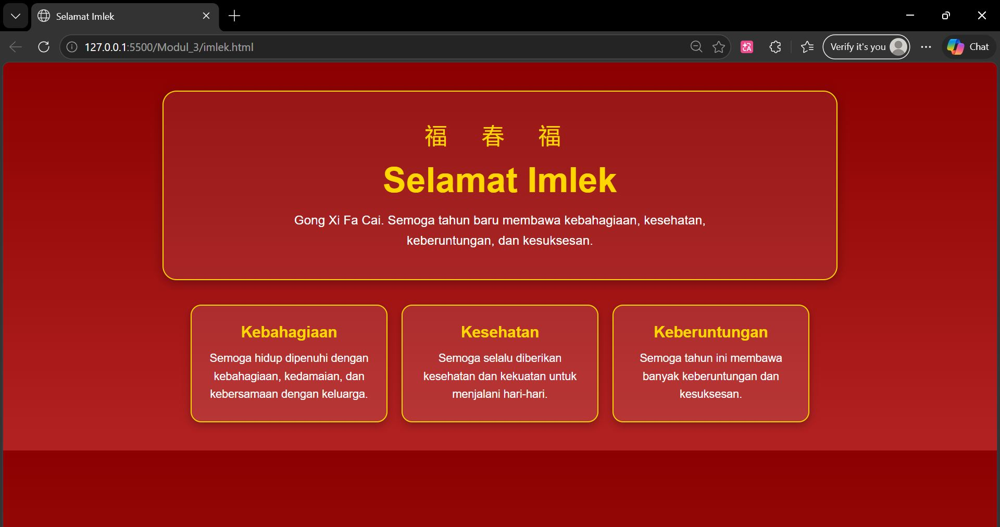

<div align="center">

# LAPORAN PRAKTIKUM  
# APLIKASI BERBASIS PLATFORM

## MODUL 3
## CSS


### Disusun Oleh
**Raihan Ramadhan**  
2311102040  
S1 IF-11-REG01  

### Dosen Pengampu
**Dimas Fanny Hebrasianto Permadi, S.ST., M.Kom**

### Asisten Praktikum
Apri Pandu Wicaksono  
Rangga Pradarrell Fathi  

### LABORATORIUM HIGH PERFORMANCE  
FAKULTAS INFORMATIKA  
UNIVERSITAS TELKOM PURWOKERTO  
2026

</div>

---

# 1. Dasar Teori
Cascading Style Sheets (CSS) merupakan bahasa yang digunakan untuk memperindah tampilan halaman web yang telah dibuat dengan HTML. CSS berfungsi untuk mengatur bagaimana elemen-elemen HTML ditampilkan di dalam browser sehingga tampilan website menjadi lebih menarik dan terstruktur. Dalam CSS terdapat selector, yaitu bagian yang menunjuk elemen HTML yang akan diberi gaya. Setelah selector, terdapat declaration block yang berisi aturan-aturan CSS. Declaration block terdiri dari property yang menentukan bagian elemen yang akan diubah serta value yang menunjukkan nilai dari property tersebut. Dalam satu selector dapat terdapat beberapa deklarasi property yang dipisahkan dengan tanda titik koma, dan seluruh declaration block dituliskan di dalam tanda kurung kurawal { }.

Dalam perancangan antarmuka web, pengaturan warna merupakan salah satu aspek yang sangat penting. HTML sebenarnya sudah menyediakan atribut untuk mengatur warna teks maupun latar belakang, namun kemampuannya terbatas. Dengan menggunakan CSS, pengaturan warna dapat dilakukan dengan lebih fleksibel dan lengkap, sehingga desain tampilan web menjadi lebih menarik dan mudah disesuaikan dengan kebutuhan.

## UNGUIDED

**Code :**

```html
<!DOCTYPE html>
<html lang="id">
<head>
  <meta charset="UTF-8">
  <meta name="viewport" content="width=device-width, initial-scale=1.0">
  <title>Selamat Imlek</title>
  <style>
    *{
      margin:0;
      padding:0;
      box-sizing:border-box;
    }

    body{
      font-family:Arial, sans-serif;
      background:linear-gradient(to bottom,#8b0000,#b22222);
      color:white;
      text-align:center;
    }

    .container{
      width:90%;
      max-width:1000px;
      margin:auto;
      padding:40px 20px;
    }

    .header{
      background:rgba(255,255,255,0.08);
      border:2px solid gold;
      border-radius:20px;
      padding:40px 20px;
      box-shadow:0 4px 15px rgba(0,0,0,0.3);
    }

    .header h1{
      font-size:50px;
      color:gold;
      margin:15px 0;
    }

    .header p{
      font-size:18px;
      max-width:700px;
      margin:auto;
      line-height:1.6;
    }

    .ornament{
      font-size:32px;
      color:gold;
      letter-spacing:20px;
    }

    .cards{
      display:flex;
      flex-wrap:wrap;
      justify-content:center;
      gap:20px;
      margin-top:35px;
    }

    .card{
      background:rgba(255,255,255,0.1);
      border:2px solid gold;
      border-radius:15px;
      width:280px;
      padding:25px 20px;
      box-shadow:0 4px 12px rgba(0,0,0,0.25);
      transition:0.3s;
    }

    .card:hover{
      transform:translateY(-5px);
    }

    .card h2{
      color:gold;
      margin-bottom:12px;
      font-size:22px;
    }

    .card p{
      font-size:16px;
      line-height:1.6;
    }

    .footer{
      margin-top:30px;
      color:#ffe9a8;
      font-size:14px;
    }

    @media (max-width:768px){
      .header h1{
        font-size:38px;
      }

      .header p{
        font-size:16px;
      }

      .card{
        width:100%;
        max-width:320px;
      }
    }
  </style>
</head>
<body>
  <div class="container">

    <div class="header">
      <div class="ornament">福 春 福</div>
      <h1>Selamat Imlek</h1>
      <p>
        Gong Xi Fa Cai. Semoga tahun baru membawa kebahagiaan,
        kesehatan, keberuntungan, dan kesuksesan.
      </p>
    </div>

    <div class="cards">

      <div class="card">
        <h2>Kebahagiaan</h2>
        <p>
          Semoga hidup dipenuhi dengan kebahagiaan,
          kedamaian, dan kebersamaan dengan keluarga.
        </p>
      </div>

      <div class="card">
        <h2>Kesehatan</h2>
        <p>
          Semoga selalu diberikan kesehatan
          dan kekuatan untuk menjalani hari-hari.
        </p>
      </div>

      <div class="card">
        <h2>Keberuntungan</h2>
        <p>
          Semoga tahun ini membawa banyak
          keberuntungan dan kesuksesan.
        </p>
      </div>

    </div>
  </div>
</body>
</html>
```

**Output :**

<p align="center">

</p>

## Penjelasan Kode Program Halaman Imlek

Kode program tersebut merupakan halaman web sederhana bertema **Imlek** yang dibuat menggunakan **HTML dan CSS tanpa JavaScript maupun library tambahan**. 

Bagian `<!DOCTYPE html>` digunakan untuk mendefinisikan bahwa dokumen menggunakan standar **HTML5**, sedangkan `<html lang="id">` menunjukkan bahwa bahasa halaman adalah **Bahasa Indonesia**. 

Pada bagian `<head>` terdapat beberapa meta tag seperti `charset="UTF-8"` untuk memastikan semua karakter dapat ditampilkan dengan benar, termasuk karakter Cina seperti **福**, serta `viewport` yang membuat halaman dapat menyesuaikan ukuran layar perangkat. Judul halaman ditentukan oleh `<title>Selamat Imlek</title>`.

Seluruh desain halaman dibuat di dalam tag `<style>` menggunakan **CSS**. Aturan:css *{ margin:0; padding:0; box-sizing:border-box; } berfungsi sebagai CSS reset untuk menghilangkan margin dan padding bawaan browser agar tata letak lebih konsisten.

Elemen body mengatur tampilan utama halaman seperti jenis font, warna teks putih, posisi teks di tengah, serta latar belakang gradasi merah menggunakan linear-gradient yang mencerminkan warna khas perayaan Imlek.Elemen .container berfungsi sebagai pembungkus seluruh isi halaman dengan lebar maksimal 1000px agar tampilan tetap rapi di berbagai ukuran layar.

Bagian .header menampilkan judul halaman dengan latar transparan, border emas, sudut membulat, dan bayangan sehingga terlihat lebih elegan. Di dalamnya terdapat .ornament yang menampilkan karakter Cina 福 春 福 sebagai simbol keberuntungan dan tahun baru, kemudian judul Selamat Imlek serta paragraf ucapan.

Selanjutnya bagian .cards menggunakan Flexbox (display:flex) untuk menyusun tiga kartu informasi secara sejajar dan otomatis menyesuaikan jika layar mengecil. Setiap .card memiliki latar transparan, border emas, sudut membulat, bayangan, serta efek animasi ketika kursor diarahkan (:hover) yang membuat kartu sedikit terangkat ke atas sehingga terlihat lebih interaktif. Di dalam kartu terdapat judul dan teks yang berisi harapan seperti kebahagiaan, kesehatan, dan keberuntungan di tahun baru Imlek.

Selain itu terdapat aturan @media (max-width:768px) yang berfungsi sebagai responsive design, sehingga ukuran teks dan kartu dapat menyesuaikan dengan layar yang lebih kecil seperti pada perangkat smartphone. Secara keseluruhan, program ini membuat halaman ucapan Imlek yang sederhana namun menarik dengan memanfaatkan struktur HTML untuk konten dan CSS untuk tampilan visual.
