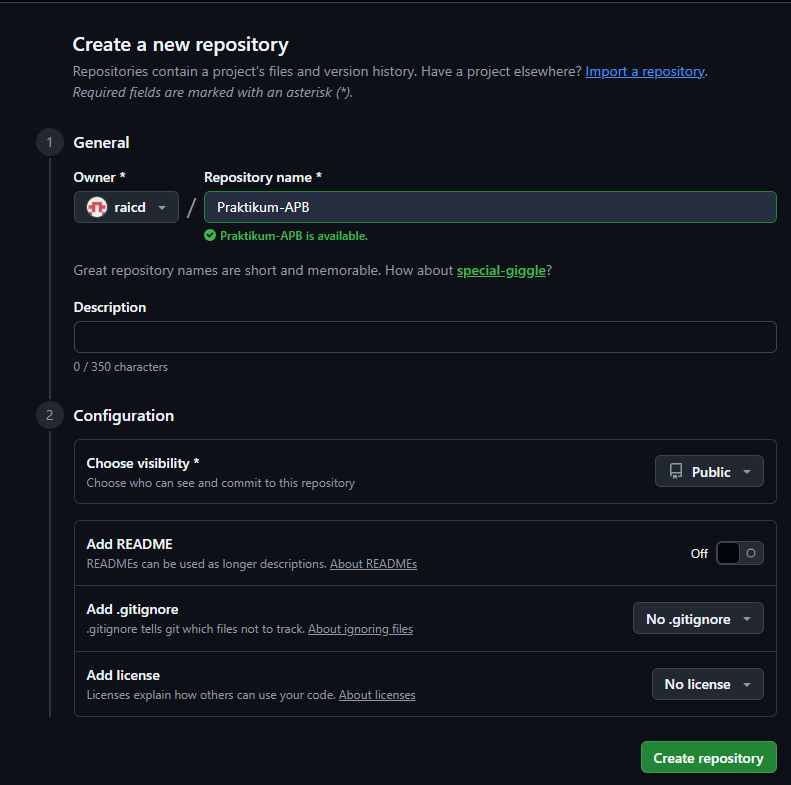
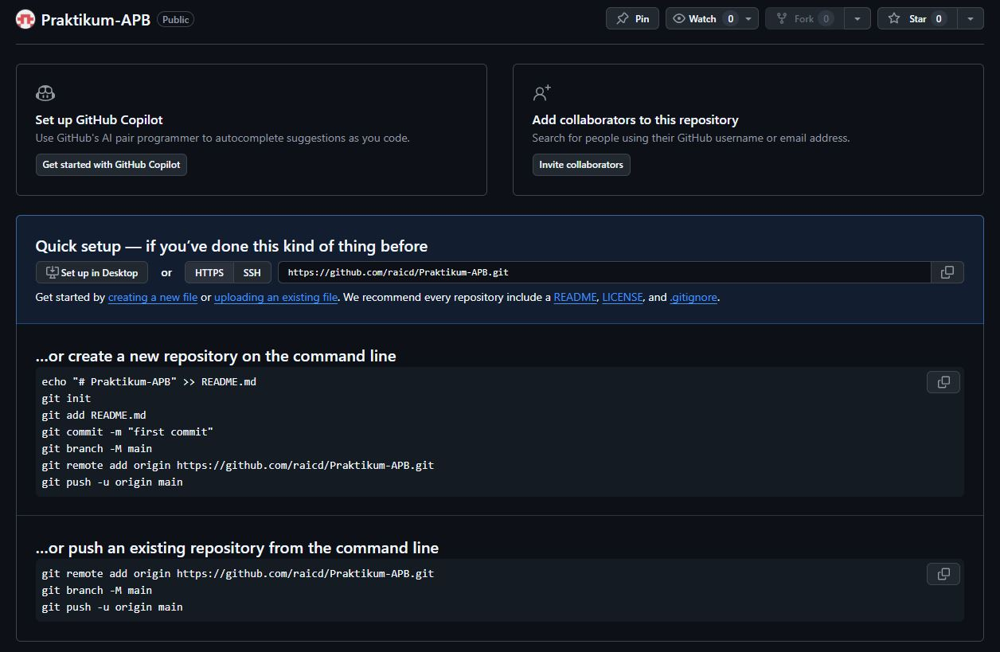
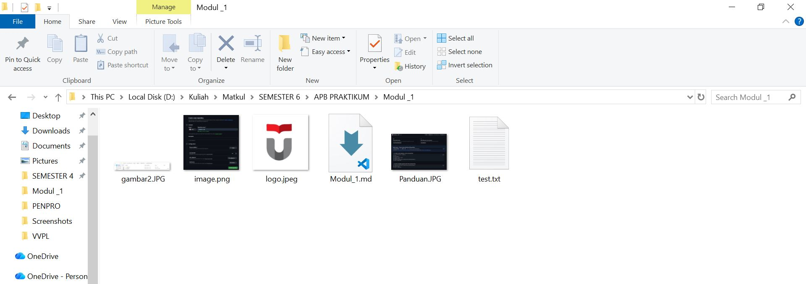
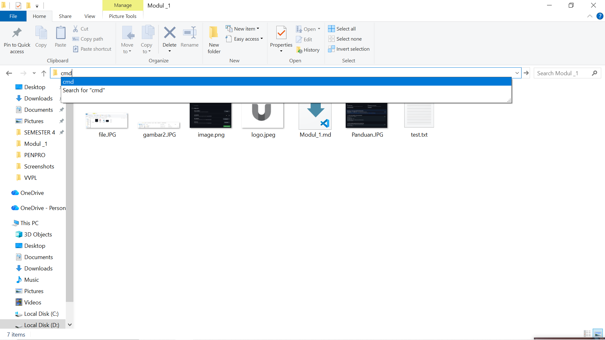
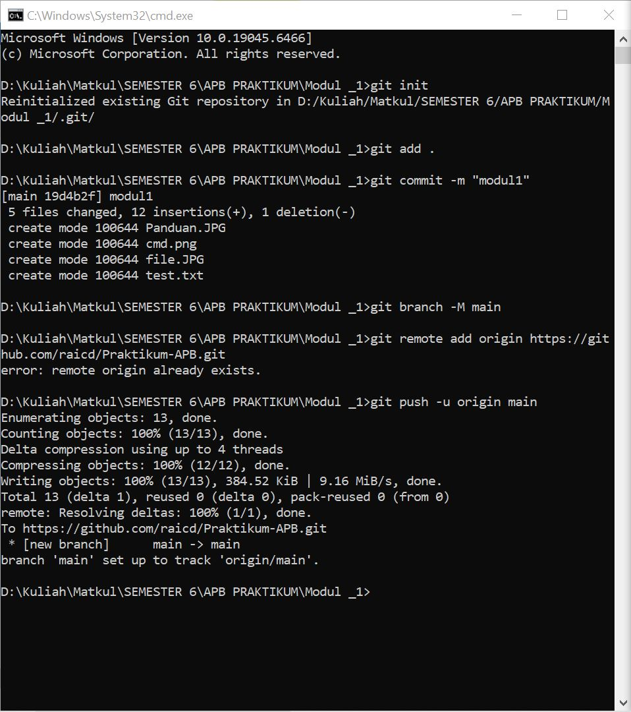
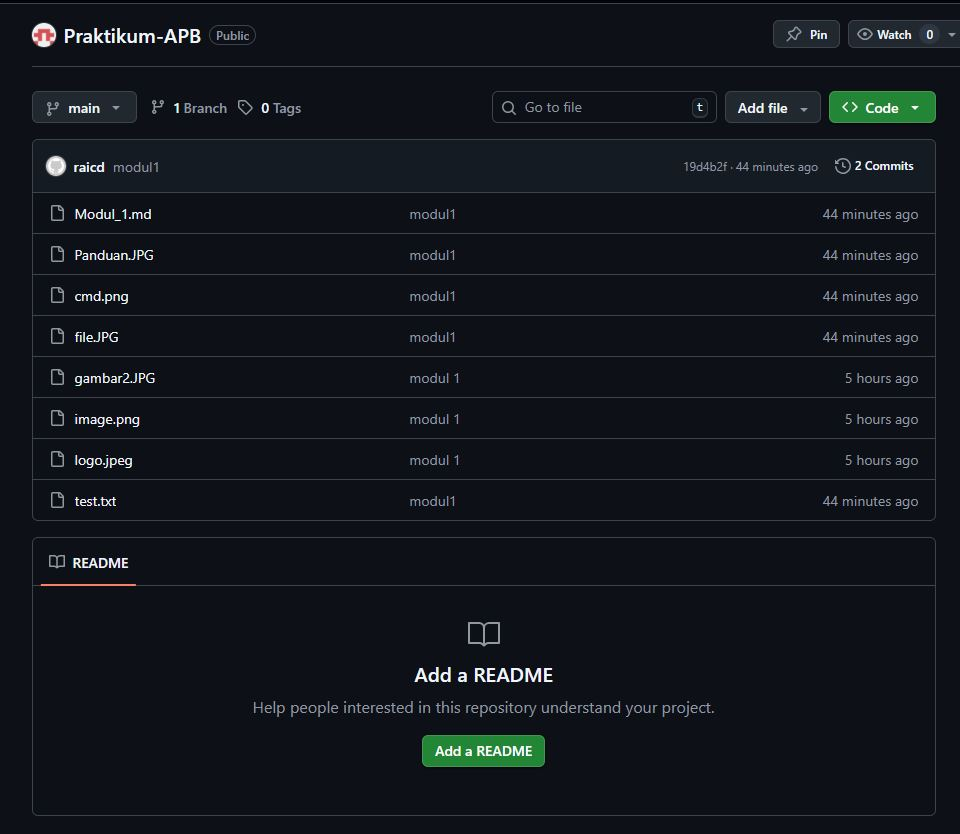

 

# LAPORAN PRAKTIKUM  
# APLIKASI BERBASIS PLATFORM

 

## MODUL 1  
## GIT

 

  

### Disusun Oleh

**Raihan Ramadhan**  
**2311102040**  
**S1 IF-11-REG01**

 

### Dosen Pengampu

**Dimas Fanny Hebrasianto Permadi, S.ST., M.Kom**

 

### Asisten Praktikum

**Apri Pandu Wicaksono**  
**Rangga Pradarrell Fathi**

  

### LABORATORIUM HIGH PERFORMANCE  
### FAKULTAS INFORMATIKA  
### UNIVERSITAS TELKOM PURWOKERTO  
### 2026

---

# 1. Dasar Teori

Git merupakan salah satu sistem pengendali versi (**Version Control System**) yang digunakan dalam pengembangan perangkat lunak dan dikembangkan oleh **Linus Torvalds**. Sistem ini berfungsi untuk mencatat setiap perubahan yang terjadi pada file dalam suatu proyek, baik yang dikerjakan secara individu maupun secara tim.

Git juga dikenal sebagai **Distributed Version Control System**, yaitu sistem kontrol versi yang penyimpanan databasenya tidak hanya berada pada satu lokasi saja, melainkan dapat tersebar di beberapa repositori.

---

# 2. Setup Repository via CLI

Berikut adalah tahapan yang dilakukan untuk melakukan inisialisasi dan pengaturan repositori dari komputer lokal menuju GitHub menggunakan **Command Line Interface (CLI)**.

---

## Langkah 1: Membuat Repositori Baru di GitHub

Langkah pertama adalah membuat repositori baru pada platform **GitHub**. Repositori ini akan menjadi tempat penyimpanan proyek secara online sehingga kode yang dibuat dapat dikelola dan dibagikan dengan mudah.

---

## Langkah 2: Panduan Perintah Git

Setelah repositori berhasil dibuat, GitHub akan menampilkan panduan berupa daftar perintah Git yang perlu dijalankan. Perintah-perintah ini nantinya digunakan untuk menghubungkan folder proyek yang ada di komputer lokal dengan repositori GitHub.

---

## Langkah 3: Membuat Folder Proyek dan File

Tahap berikutnya adalah menyiapkan folder proyek pada direktori komputer, misalnya membuat folder **Modul_1**. Di dalam folder tersebut, tambahkan minimal satu file contoh seperti **test.txt** yang akan digunakan sebagai isi awal repositori. Pada tahap ini juga dapat ditambahkan beberapa file lain sesuai kebutuhan proyek.

---

## Langkah 4: Membuka CMD dari Direktori Folder Proyek

Selanjutnya buka **Command Prompt (CMD)** atau terminal, kemudian arahkan lokasi direktori ke folder proyek yang telah dibuat sebelumnya. Hal ini bertujuan agar setiap perintah Git yang dijalankan nantinya diterapkan pada folder proyek yang benar.

---

## Langkah 5: Menjalankan Perintah Git di Terminal (Push ke GitHub)

Pada tahap ini, seluruh perintah Git yang ditampilkan sebelumnya dijalankan secara berurutan melalui terminal. Proses dimulai dengan:

- Menginisialisasi Git pada folder lokal (`git init`)
- Menambahkan file ke staging area (`git add`)
- Melakukan commit perubahan (`git commit`)
- Menghubungkan repositori lokal dengan repositori GitHub
- Mengunggah file ke GitHub menggunakan perintah (`git push`)

---

## Langkah 6: Repositori Berhasil Diperbarui

Apabila proses pengunggahan (`git push`) berjalan dengan lancar tanpa kendala, maka seluruh file dan folder yang ada pada proyek lokal akan berhasil tersimpan di repositori GitHub. Dengan demikian, proyek tersebut sudah siap digunakan dan dapat dikembangkan secara kolaboratif.

